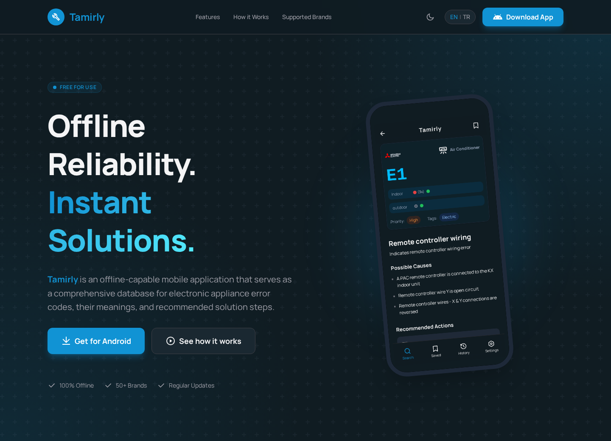

<!-- markdownlint-disable MD033 MD041 -->


# `Tamirly Landing`   [](https://ahmetcetinkaya.me/donate)

This repository contains the official landing page for **Tamirly** - an
offline-first mobile application that serves as a comprehensive database for
electronic appliance error codes, their meanings, and recommended solution steps.

The landing page serves as the primary gateway for technicians and DIYers to
discover, understand, and download Tamirly from Google Play Store.

**Get it on:** [](https://play.google.com/store/apps/details?id=me.ahmetcetinkaya.tamirly)

## 🌐 About

This landing page is built with modern web technologies to provide fast
performance, responsive design, WCAG 2.1 AA accessibility, and SEO
optimization - all with a privacy-focused, self-hosting ready approach.

**Tech Stack**:




## 🚀 Quick Start

```bash
# Clone and setup
git clone https://github.com/ahmetcetinkaya/tamirly-landing.git
cd tamirly-landing
git submodule update --init --recursive
bun install

# Start development
bun run landing:dev  # Visit http://localhost:4321
```

Refer to [docs/README.md](docs/README.md) for the documentation index.

## 🎨 Key Features

The landing page showcases Tamirly's core capabilities:

- **100% Offline Database** - Thousands of error codes without internet
- **Brand Specific Search** - Mitsubishi, Daikin, LG, Samsung, and 50+ brands
- **Step-by-Step Fixes** - Detailed recommended actions
- **LED Pattern Decoder** - Identify errors from blinking patterns
- **Multi-Language Support** - Global accessibility
- **History & Saved** - Quick access to frequently used codes

## 📄 License

GNU General Public License v3.0 - see [LICENSE](LICENSE)
